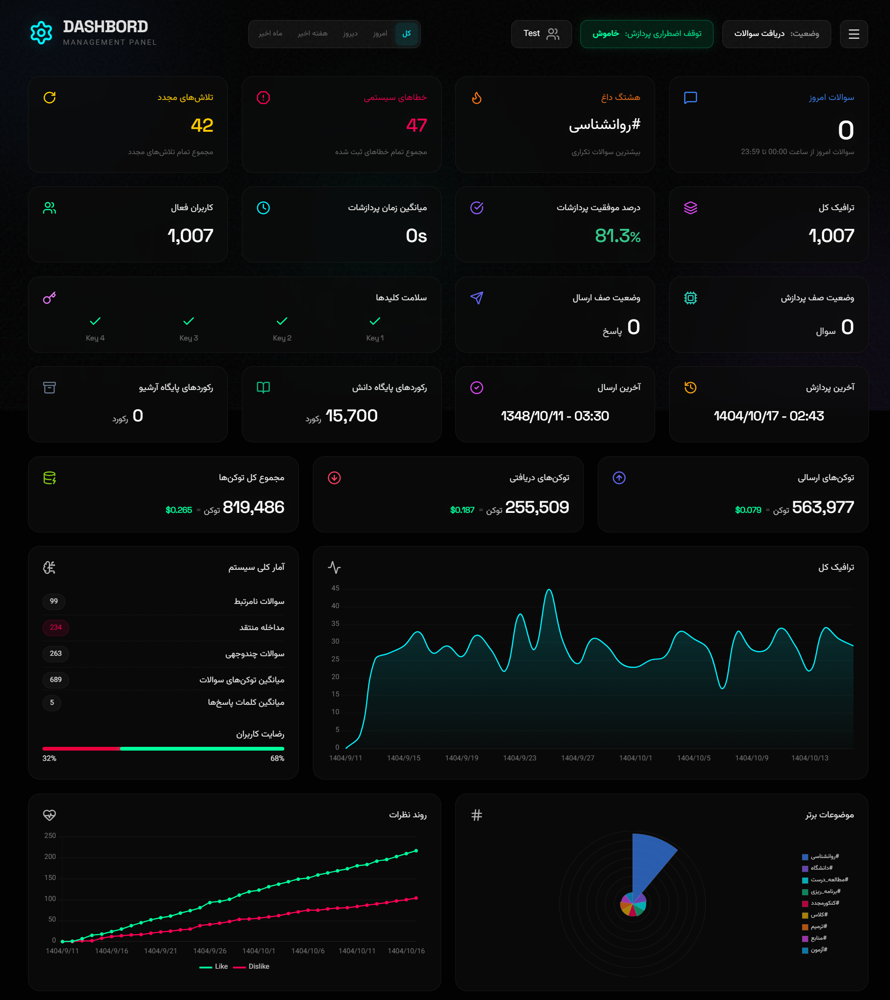
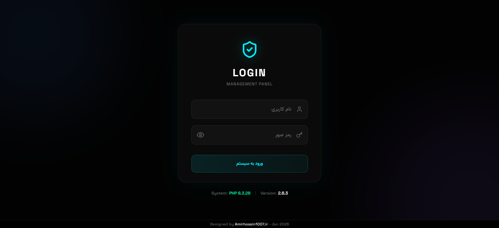

## Description

This is a **Raw Template** extracted from the main project **AI Bot Management Panel**. It serves as a lightweight, database-free starter kit for developers who need a secure and modern admin interface without the hassle of setting up SQL databases.

### ✨ Key Features
- **Zero Configuration:** No database needed (MySQL/PostgreSQL).
- **Auto-Setup:** On the very first run, simply enter your desired username and password. The system will create the admin file automatically.
- **Glassmorphism UI:** A sleek, modern design with smooth animations.
- **Security:** Built-in BCrypt hashing, brute-force protection, and session management.

### ⚠️ Requirements
PHP 7.4 or higher.
Write permission on the login folder.

---

### Designed by <a href='https://amirhossin1007.ir/'>Amirhossin1007.ir
